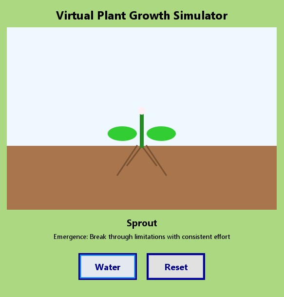
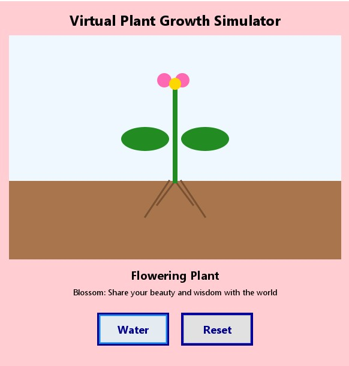
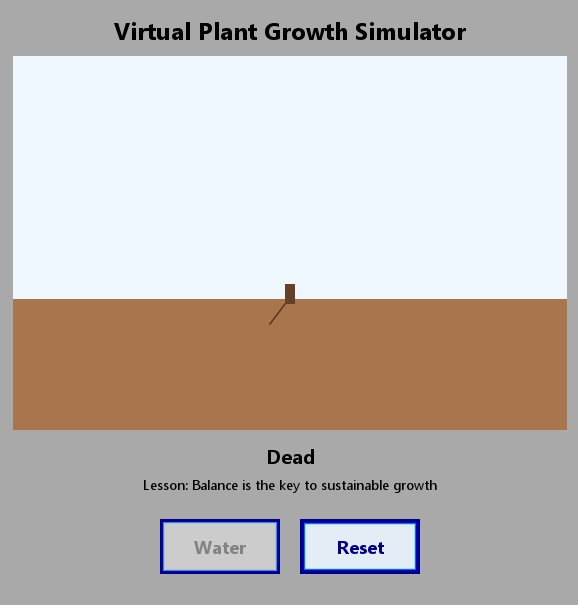

# Virtual Plant Growth Simulator

[](https://www.oracle.com/java/)
[]()

An interactive Java application that demonstrates the principles of sustainable growth through plant cultivation simulation. This educational tool illustrates the delicate balance between nurturing development and the consequences of excess, providing profound insights into personal and professional growth dynamics.

## Overview

The Virtual Plant Growth Simulator serves as an interactive metaphor for human development, teaching essential life lessons through the simple act of plant care. By requiring precise watering at each growth stage, users learn the importance of balance, timing, and moderation in achieving sustainable success.

## Project Purpose

**🎯 WHY THIS PROJECT EXISTS:**

**This project was created purely for fun and learning GUI development with Java Swing!** To make the basic Swing application more attractive and engaging, we added an interactive plant growth simulation with different life stages. The educational life lessons are a bonus feature that adds depth and meaning to what started as a simple GUI practice project.

**What began as a fun experiment in Swing components and event handling evolved into a meaningful application that teaches balance and consequences through interactive plant care.**

## Key Features

- **Interactive GUI Interface** - Professional Swing-based application with intuitive controls
- **Educational Framework** - Seven distinct growth stages, each conveying meaningful life principles
- **Behavioral Consequences** - Realistic simulation of overwatering effects and recovery cycles
- **Visual Feedback System** - Dynamic color-coded stages with contextual messaging
- **Reset Functionality** - Opportunity for reflection and iterative learning
- **Cross-Platform Compatibility** - Runs on Windows, macOS, and Linux systems

## Educational Objectives

| Growth Stage | Core Principle |
|-------------|---------------|
| **Seed** | Foundation: Establish strong roots before pursuing ambitious goals |
| **Sprout** | Emergence: Overcome limitations through consistent, deliberate effort |
| **Young Plant** | Development: Build resilience through structured challenges |
| **Flowering Plant** | Contribution: Share accumulated wisdom and beauty with others |
| **Wilting** | Warning: Recognize when excess begins to compromise vitality |
| **Dying** | Consequences: Understand the irreversible damage of sustained imbalance |
| **Termination** | Reflection: Internalize that sustainable growth requires perpetual equilibrium |

## Technical Requirements

- **Java Development Kit** - Version 11 or higher (JDK 17 recommended)
- **Operating System** - Windows 10+, macOS 10.14+, or Linux distributions
- **Memory** - Minimum 256MB RAM
- **Display** - 1024x768 resolution or higher for optimal interface rendering

## Installation and Execution

### Source Code Compilation
```bash
# Navigate to project directory
cd VirtualPlantGrowthSimulator

# Compile Java source files
javac -d out src/com/plantgrowth/*.java
```

### Application Launch
```bash
# Execute graphical user interface
java -cp out com.plantgrowth.VirtualPlantGrowthSimulator

# Alternative: Execute console-based interface
java -cp out com.plantgrowth.ConsolePlantSimulator
```

## Usage Guidelines

1. **Initialization** - Launch the application using provided execution commands
2. **Interaction** - Utilize the "Water" control to provide nourishment at appropriate intervals
3. **Observation** - Monitor stage progression and assimilate presented educational content
4. **Moderation** - Apply exactly two watering instances per developmental phase
5. **Analysis** - Study the repercussions of excessive intervention
6. **Iteration** - Employ reset functionality to reinforce learned principles

## Application Screenshots

### 🌱 Growth Stages Visualization

| Seed Stage | Flowering Stage | Dead Stage |
|------------|-----------------|------------|
|  |  |  |
| **Beginning**: Foundation stage with initial setup | **Peak**: Mature plant in full bloom | **Consequence**: Result of overwatering excess |

*Visual demonstration of the plant's complete life cycle, from humble beginnings to inevitable decline when balance is not maintained.*

## Application Demo

### 📹 Video Demonstration

🎬 **[Watch the Virtual Plant Growth Simulator Demo](java%20swing%20project%20vedio.mp4)**

*Click the link above to watch the complete interactive demonstration of the Virtual Plant Growth Simulator, showcasing the growth stages, watering mechanics, and educational lessons.*

> **Note**: The video demonstrates the full plant growth cycle, from seed to flowering plant, and shows the consequences of overwatering. It includes both the GUI interface and educational messages for each stage.

## Project Architecture

```
VirtualPlantGrowthSimulator/
├── src/
│   └── com/plantgrowth/
│       ├── VirtualPlantGrowthSimulator.java  # Primary GUI application
│       ├── PlantPanel.java                    # Custom visualization component
│       ├── ConsolePlantSimulator.java         # Text-based interface implementation
│       └── OverWateringException.java         # Specialized exception handling
├── HOW_TO_RUN.md                              # Comprehensive operational guide
└── README.md                                  # Project documentation
```

## Educational Impact

This simulation effectively demonstrates:
- **Software Development** - Object-oriented design, event-driven programming, and user interface construction
- **Systems Thinking** - Understanding interconnected cause-and-effect relationships
- **Behavioral Psychology** - Learning through interactive consequence simulation
- **Decision Making** - Evaluating the balance between action and restraint

## Future Enhancements

Potential development opportunities include:
- Expanded growth stage implementations
- Enhanced visual rendering capabilities
- Supplementary educational content modules
- Multi-language interface localization
- Advanced statistical tracking and analytics
- Integration with external educational platforms

## Acknowledgments

Developed utilizing Java Swing framework for robust cross-platform interface design. Inspired by natural growth cycles and the fundamental importance of equilibrium in all developmental processes.